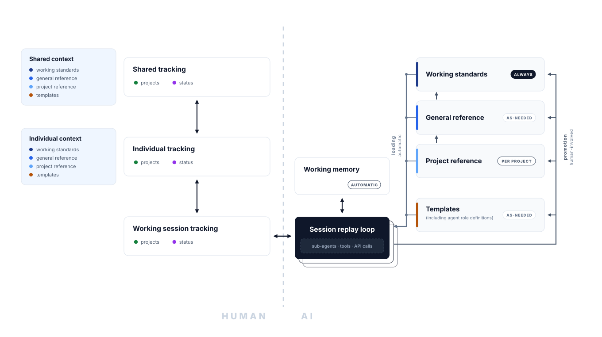

# Memory Layers

*Which store a durable fact belongs in, when it loads back, and which store wins when two disagree.*

> Skeleton. §3 is the part that is genuinely yours — fill in the stores you actually have. The rest
> transfers as written.

---

## 1. Two axes

**Tier** decides how often a fact is loaded back into context. **Scope** decides who can see it —
shared (committed, reaching colleagues and your other machines) or individual (this machine, this
surface, this user).

Most placement mistakes are one of these two answered wrongly, and the expensive one is tier.

**Tracking is not context.** Task lists, project status and sprint state get reconciled, not promoted.
Conflating the two is how an end-of-session knowledge pass turns into a status meeting.

## 2. The four content types

| Type | What it is | The test | Loads |
|---|---|---|---|
| **Working standards** | The human–AI relationship and how to improve that layer | Does this change how we work together, in any project? | `ALWAYS` |
| **General reference** | Context and information useful on an as-needed basis | Would I want this to hand whenever the topic comes up? | `AS-NEEDED` |
| **Project reference** | Context specific to a project that persists across sessions. A project has a defined desired outcome, a finish line, or a named deliverable | Does this stop meaning anything once the project ships? | `PER PROJECT` |
| **Templates** | Reusable units for completing a *category* of work — checklists, agent role definitions, log skeletons — rather than the work unit itself | Is this the thing, or the mould the thing is made in? | `AS-NEEDED` |

The type is a property of the content and travels with it; the store is an accident of which surface
happened to be open. A store-first taxonomy has to be re-derived every time a new tool appears; a
content-first one absorbs the new tool as another column.

## 3. Where each type lives

> Fill this in for your setup. The columns are the two axes; the rows are the four types. Every store
> you use appears in exactly one cell per row, and anything else points at it.

| Type | Shared — committed, reaches others | Individual — one machine or one surface |
|---|---|---|
| Working standards | `<always-loaded manifest>`, `memory/context/<name>-profile.md` | `<user-level config>`, `<cross-surface preference store>` |
| General reference | `memory/`, `docs/`, `<tool notes>` | `<per-surface memory>` |
| Project reference | `projects/<slug>/` — canonical — and the project's own `decisions.md` | `<per-surface memory>`, holding a **pointer** to the project folder |
| Templates | `templates/`, `skills/`, `<agent role definitions>` | `<user-level agents or commands>` |
| *Tracking (other axis)* | `projects/INDEX.md`, per-project `STATUS.md` | `<your task system>` |

Two rules make the table usable:

- **Project reference is canonical in the project folder.** Everything collaborated on lives there so
  it is under version control; a memory store holds at most a pointer back to it. A project fact held
  in two places is two copies that will age at different rates.
- **A pointer is not a copy.** The right shape is one line: what it is, where the canonical file is,
  and when to read it.

## 4. Precedence

1. **Project reference wins inside its project scope.** It sits closer to the work and it was written
   with the finish line in view.
2. **Below that, the most specific store wins**, and the loser gets corrected rather than left to
   disagree quietly.
3. **Working standards govern how, not what.** They set posture, register and conventions; they do
   not overrule a project's factual content.
4. **Shared beats individual** when both exist and diverge — see §6.

## 5. The always-loaded tier is a budget

Every other tier is additive: a file in `docs/` costs nothing until something asks for it. The
always-loaded tier is zero-sum, because every future session pays for it whether or not it turns out
to be relevant.

- Adding a line to an always-loaded file means naming the line it replaces, or making the case that
  the budget should grow — with a human agreeing, not as a side effect of a closeout.
- **An index is not content.** One line per entry: a pointer and a hook. A paragraph in an index
  belongs in the file it points at.
- The bar for `ALWAYS` is that a future session would go wrong *without ever thinking to ask*. A
  gotcha that bites on one task belongs with that task's material.

Put a number on it and report it weekly. Growth becomes arguable once it is visible.

There is a second, independent argument for keeping the tier small, and it is about the person rather
than the context window: a store that covers everything removes every occasion to work anything out,
and unaided retention falls as coverage rises. Looking something up means not reconstructing it, and
reconstruction is the only full rehearsal.

## 6. The visibility rule

Individual stores reach nobody else. A gitignored working note exists only on the machine that wrote
it; a personal memory directory is narrower still — one machine, one surface, invisible even to
another agent in the same repository.

Promoting something that others or your other surfaces need into a personal store is the most common
way to lose it. It feels like filing.

## 7. Promotion, demotion, and house rules

**The cascade is project → general → standards**, by rewriting in general form. This is the same
filter the decisions log applies: strip out the specifics and see whether anything survives.

**Promotion is human-involved; loading is automatic.** Keeping that asymmetry is what stops the
always-loaded tier filling with plausible material nobody chose.

**Demotion is real and mostly unattended.** Stores go stale as the world moves. A stale `ALWAYS`
entry is the expensive case, because it primes every session regardless.

Four house rules that travel:

- Surgical updates. The line that changed, not a wholesale rewrite of the file around it.
- Absolute dates. A relative one rots the moment the session ends.
- Verify a technical claim against the current file or code before recording it.
- Record the rejected alternative alongside the decision.
- Merge before you point. When retiring a duplicate, move its unique material into the canonical file
  first — a pointer at a file missing four entries loses four entries — and where the copies disagree,
  keep the losing reading in the winning file so the question stays open rather than looking settled.
